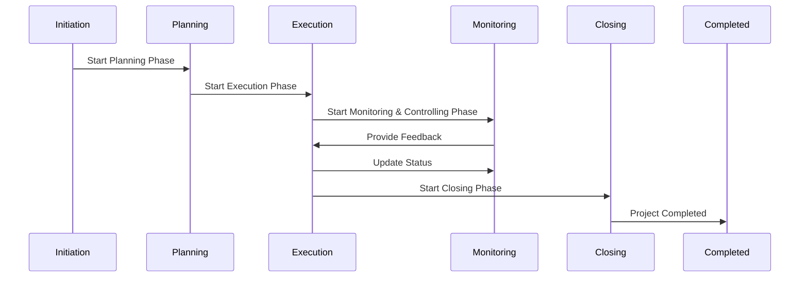
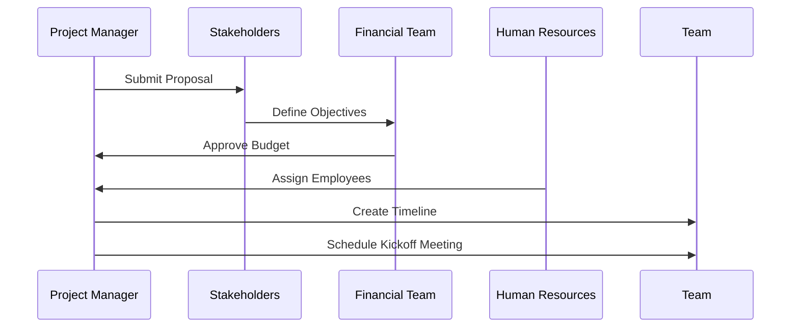
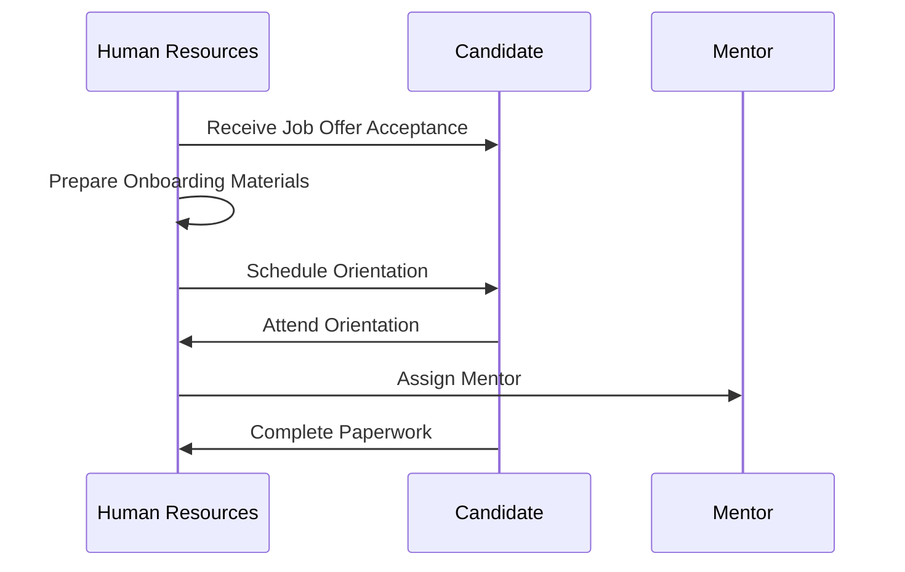
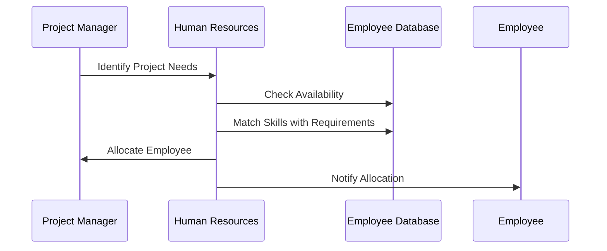

You are a software architect working on a system to manage complex it project themselves. 

One of the most important entity within the system is the project itself. It includes members (employees), where reach have their skills. Project has budget, dates, etc. 

I would like you to suggest a complex domain model for the project. I want the model to tackle problems such as milestones, crossing deadlines, crossing the budgets and more. There should be also a way to determine how a given project is financially successful.

The project's employees are a cost.. However, they're should be some income. How is the income received? Is it a fixed price after everything is finished - or is it a monthly fee? Body leasing?

I want you to create a set of interfaces (in typescript) to handle all these problems. They're should be at least a dozen different interfaces that cover the above domain complexity. In order to answer a given question (e.g. how financially  effective is s given project) there should be a simple function signature with the input data defined, as well as the output.

Employees or software developers work not only on internal R&D projects, but also ate borrowed (body leasing) as contractors to other companies/projects. Include charging, include the contracts which provide the timeline on how long employees are borrowed, include how much time weekly or monthly spend on the project. Maybe some timesheets.

Now, the model needs to answer the questions below. If the model doesn't have data required to answer the questions, suggest extending the model. 

The questions are: 
- how the project is effective financially both in general and within a specific time frame?
- is the project allocating people with proper skills? Is the employees allocation correct? 
- which employees are working on which projects and in what amount of time?
- which employees have no project (sitting on the bench)?
- how can we rank employees via their skills and experience - who is more likely to get allocated again and who isn't (e.g. because the skills are rarely needed)?
- how do we measure which employees work how many hours/days for a given project? 

More info:
- Financial Effectiveness is evaluated within a specified timeframe.
- Skill Allocation checks if employees have proper skills for their projects.
- Time Tracking records hours worked by employees on projects.
- Employee Availability identifies who is currently unallocated.
- Ranking Skills helps prioritize employees based on demand and experience.
- Budget Variance Calculation provides insights into budget management.

## Business processes

- setting up a new project
- onboarding a new employee
- allocating an employee

## rich domain model

```ts
interface IProject {
    id: string;
    name: string;
    budget: number;
    startDate: Date;
    endDate: Date;
    status: ProjectStatus; // Existing statuses
    charter: IProjectCharter;
    plan: IProjectPlan;
    contracts: IContract[];
    timesheets: ITimesheet[];
    milestones: IMilestone[];
    employees: IEmployee[];
    timeTracking: ITimeTracking[];
    // methods:
    execute(): void; 
    monitor(): void; 
    close(): void; 
    addMilestone(milestone: IMilestone): void;
    calculateBudgetUsage(): number;
    evaluateFinancialEffectiveness(timeFrame?: Date[]): FinancialEffectiveness;
    calculateTotalIncome(): number; // Calculate total income from contracts
    calculateContractedHours(): number; // Calculate total hours worked by contracted employees
}


interface IProjectCharter {
    purpose: string;
    objectives: string[];
    stakeholders: IStakeholder[];
}

interface IProjectPlan {
    goals: IGoal[];
    scope: string;
    resources: IResource[];
    timeline: ITimeline;
}

interface IStakeholder {
    id: string;
    name: string;
    role: string;
}

interface IGoal {
    description: string;
    deadline: Date;
}

interface IResource {
    id: string;
    type: string; // e.g., human, financial, material
}

interface ITimeline {
    startDate: Date;
    endDate: Date;
}

enum ProjectStatus {
    Initiation,
    Planning,
    Execution,
    Monitoring,
    Closing,
    Completed
}

interface IEmployee {
    id: string;
    name: string;
    skills: ISkill[];
    hourlyRate: number;
    allocatedProjects: IProject[];
    totalExperience: number; // in years
    skillRatings: ISkillRating[]; // rating for each skill
    contracts: IContract[]; // Contracts for body leasing
    availableHours: number; // Hours available for allocation
    // methods:
    calculateCost(hoursWorked: number): number;
    calculateAvailability(): boolean; // true if available for allocation
    assignToProject(projectId: string): void;
    rankSkills(): ISkillRanking[]; // returns ranked skills based on experience and demand
    logHours(timesheetId:string): void; // Log hours to a timesheet
}

interface IMilestone {
    id: string;
    name: string;
    dueDate: Date;
    status: 'pending' | 'completed';
    markAsComplete(): void;
}

interface IIncome {
    projectId: string;
    amount: number;
    type: 'fixed' | 'monthly' | 'body leasing';
}

interface IBudget {
    totalAmount: number;
    spentAmount: number;
    checkBudgetStatus(): boolean; // true if within budget
    calculateBudgetVariance(): number; // calculates difference between budgeted and actual costs 
}

interface ISkill {
    skillId: string;
    name: string;
    level: number; // 1 to 5 scale
}

interface ISkillRating {
    skillId: string;         
    employeeId: string;      // Identifier for the employee
    rating: number;          // Rating scale (e.g., 1 to 5)
    lastUpdated: Date;       // Date when the rating was last updated
}

interface IFinancialReport {
    projectId: string;
    incomeList: IIncome[];
    expensesList: IExpense[];
    generateReport(): Report;
}

interface IExpense {
    amount: number;
}

interface IProjectManager {
    projects: IProject[];
    addProject(project: IProject): void;
}

interface IBudgetManager {
    budgets: IBudget[];
}

interface IEmployeeManager {
    employees: IEmployee[];
}

interface IReportingService {
    generateFinancialReport(projectId: string): IFinancialReport;
}

// Function to evaluate financial effectiveness of a project
function evaluateFinancialEffectiveness(projectId: string, timeFrame?: Date[]): { successRate: number; profitMargin: number } {
   // Implementation logic here...
}

interface ITimeTracking {
    employeeId: string;
    projectId: string;
    hoursWorked: number;
    date: Date;
    
    logHours(hoursWorked: number): void; 
    getTotalHoursForProject(projectId:string): number; // returns total hours logged for a project
}

interface IAllocationManager {
     allocateEmployeeToProject(employeeId:string, projectId:string): void; 
     checkSkillMatch(employee:IEmployee, project:IProject): boolean; // checks if employee skills match project needs
}

interface IEmployeeManager {
     employees:IEmployee[];
     getEmployeesWithoutProjects(): IEmployee[]; // returns employees not allocated to any project
}

interface FinancialEffectiveness {
    projectId: string;              // Identifier for the project
    totalIncome: number;            // Total income generated from the project
    totalExpenses: number;          // Total expenses incurred for the project
    profitMargin: number;           // Profit margin calculated as (totalIncome - totalExpenses) / totalIncome
    successRate: number;            // Success rate of the project, can be calculated based on various criteria (e.g., meeting deadlines, budget)
    timeFrame?: Date[];             // Optional timeframe for evaluating effectiveness
}

interface IContract {
    id: string;
    projectId: string;
    employeeId: string;
    startDate: Date;
    endDate: Date;
    hourlyRate: number;
    totalHours?: number; // Optional total hours worked
    calculateTotalCost(): number; // Calculate total cost of the contract
}

interface ITimesheet {
    id: string;
    employeeId: string;
    projectId: string;
    hoursWorked: { weekEndingDate: Date; hours: number }[]; // Array of weekly hours
    addHours(hours:number): void; // Add hours to the timesheet
    getTotalHours(): number; // Get total hours logged for the project
}

interface ICharging {
    contractId:string;
    amountCharged:number;
    billingCycle:'monthly' | 'weekly'; 
    generateInvoice(): IInvoice; // Generate an invoice based on the contract details
}

interface IInvoice {
    id:string;
    contractId:string;
    amountDue:number;
    dueDate: Date;
    
    markAsPaid(): void; // Mark the invoice as paid
    getInvoiceDetails(): string; // Get details of the invoice
}
```

## Project Lifecycle Phases

## 1. Initiation Phase
- Define the project at a high level.
- Create a project charter and identify stakeholders.
- Conduct feasibility studies and cost-benefit analyses.

### 2. Planning Phase
- Develop a comprehensive project management plan.
- Set SMART goals and define the project scope.
- Identify resources, create a timeline, and establish communication plans.

### 3. Execution Phase
- Implement the project plan by executing tasks and managing resources.
- Develop the team, assign responsibilities, and procure necessary resources.
- Monitor progress and make adjustments as needed.

### 4. Monitoring & Controlling Phase
- Track project performance against the plan.
- Manage changes to the project scope, schedule, and costs.
- Ensure quality control and risk management.

### 5. Closing Phase
- Finalize all activities to formally close the project.
- Deliver completed products to stakeholders and obtain acceptance.
- Conduct post-project evaluations and document lessons learned.



# Business Processes 

## 1. Setting Up a New Project

### Description
This process involves defining a new project, gathering necessary resources, and assigning team members.

**Steps:**
1. **Initiate Project**: The project manager submits a project proposal.
2. **Define Objectives**: Stakeholders meet to outline project goals.
3. **Allocate Budget**: The financial team approves the budget.
4. **Assign Team Members**: HR assigns employees based on skills.
5. **Create Timeline**: The project manager develops a project timeline.
6. **Kickoff Meeting**: Conduct a meeting to launch the project.



---

## 2. Onboarding a New Employee

### Description
This process outlines the steps to integrate a new employee into the organization.

**Steps:**
1. **Receive Job Offer Acceptance**: HR receives confirmation from the candidate.
2. **Prepare Onboarding Materials**: HR prepares necessary documents and resources.
3. **Schedule Orientation**: HR schedules an orientation session.
4. **Conduct Orientation**: The new employee attends orientation.
5. **Assign Mentor**: HR assigns a mentor for guidance.
6. **Complete Paperwork**: The new employee fills out required forms.



---

## 3. Allocating an Employee

### Description
This process details how employees are assigned to projects based on their skills and availability.

**Steps:**
1. **Identify Project Needs**: The project manager assesses requirements for the project.
2. **Check Employee Availability**: HR checks available employees.
3. **Match Skills with Requirements**: HR matches employee skills to project needs.
4. **Allocate Employee**: HR allocates the selected employee to the project.
5. **Notify Employee and Project Manager**: Both parties are informed of the allocation.


